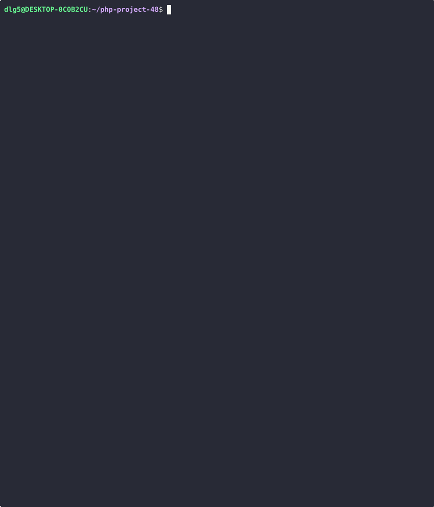

# GenDiff. Compare JSON and YAML files.
### Hexlet tests and linter status:
[](https://github.com/dlgv24/php-project-48/actions)
[](https://github.com/dlgv24/php-project-48/actions)
[](https://sonarcloud.io/summary/new_code?id=dlgv24_php-project-48)
## About project
This is a CLI application that displays file differences in various formats
## Prerequisites
- Linux, Macos, WSL
- PHP >= 8.0
- Composer >= 2.8.0
- Make
- Git
## Setup
```
$ git clone git@github.com:dlgv24/php-project-48.git

$ cd php-project-48 

$ make install  
```
## Demonstration of project
### Stylish
[](https://asciinema.org/a/EnMWC8Bs0DufKZKRYHisDiEFY)
### Plain
[](https://asciinema.org/a/46q2JQl39ysqAUKIjhMpzDW2y)
### Json
[](https://asciinema.org/a/7IDoW70OeFdkgvRgPMG5V1HVA)
